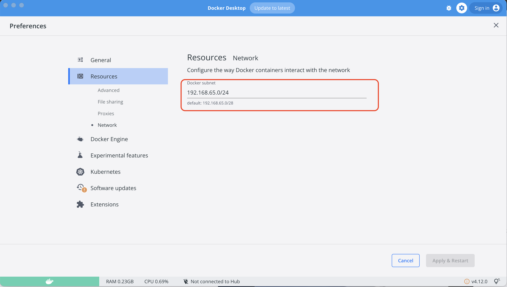

# Prestashop CRM with Docker

This is a project to deploy a Prestashop CRM with Docker.

## Requirements

- [Install Docker](https://docs.docker.com/get-docker/)
- [Install Docker Compose](https://docs.docker.com/compose/install/)

## Configuration

Edit the file `env/.env.${ENVIRONMENT}` and set the environment variables.

## Data Structure

This is the structure of the cloned project:

````bash
├── docker-images
│   └── mysql
│   └── nginx
│   └── php
├── env
│   └── .env.dev
│   └── .env.qa
│   └── .env.prod
├── docs
├── README.md
└── docker-compose.yml

## How to use

### Docker

#### Build

```bash
COMPOSE_PROFILES=db,web docker compose --env-file env/.env.${ENVIRONMENT} --project-name ${PROJECT_NAME} up -d
````

#### Stop

```bash
COMPOSE_PROFILES=db,web docker-compose --env-file env/.env.${ENVIRONMENT} --project-name ${PROJECT_NAME} down
```

#### Remove image

```bash
docker rmi ${IMAGE_NAME}
```

## Find docker subnet in docker desktop


